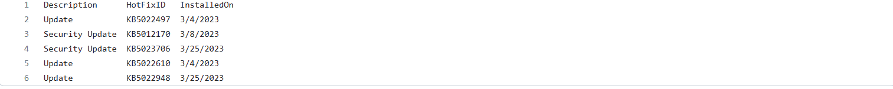
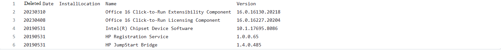

# INT301
<h1>Use any available open-source software to generate a report of your system to check how many new software is installed, how many are deleted, and how many updates have been done in the last 3 months.</h1>
***
<h1>Download and install Belarc Advisor on your computer from the official website (https://www.belarc.com/products_belarc_advisor).</h1>

___
<h1>Install and launch Belarc Advisor and wait for it to complete a system scan</h1>

___
<h1>Scroll down to the "Software Versions & Usage" section and look for the "Installed Software" subsection</h1>

___
<h1>It will filter the list by updates and deletions in the last 3 months, look for the "Installed On" column and note the date of the latest installation or update.</h1>

___
<h1>Compare the dates from steps 5 and 8 to identify any software updates or deletions that have occurred in the last 3 months</h1>

___
<h1>II Marks software installed within the past 90 days.</h1>

___
<h1>Updated Software</h1>

___
<h1> Deleted Software</h1>
